# Evidence

QA record for the core flows, run end-to-end against the Airwallex sandbox with browser-driven tests over real card elements and real PaymentIntents. All intent IDs below are real sandbox objects and can be looked up in the Airwallex dashboard (Transactions, then Payments) to see the authorization and capture events.

## Happy path: two holds, captured together

Order `split-0e3e381e`, AUD $1,200.00 split 50/50.

| Card | Amount | PaymentIntent | Final status |
|---|---|---|---|
| 1 | $600.00 | `int_hkdm5hl7nhk09vmcyu8` | `SUCCEEDED` (captured) |
| 2 | $600.00 | `int_hkdm7g8s4hk09vmj3sy` | `SUCCEEDED` (captured) |

1. Card 1 confirmed with `autoCapture: false`. A hold is placed, the UI shows **"Held ✓ (not charged)"**, and the intent sits at `REQUIRES_CAPTURE`:

   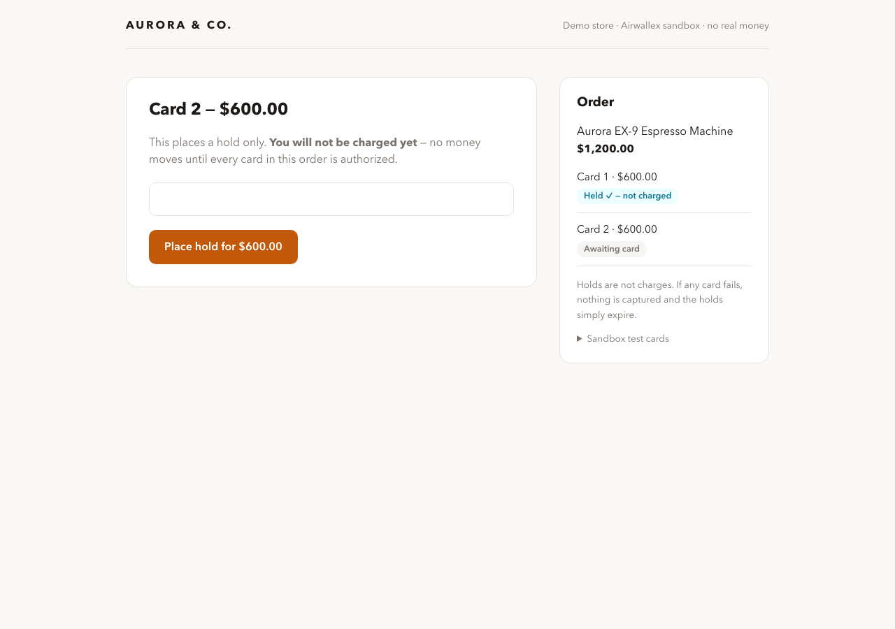

2. Card 2 confirmed. Both slots reach `REQUIRES_CAPTURE`, the server captures both sequentially, and the success screen shows both intent IDs:

   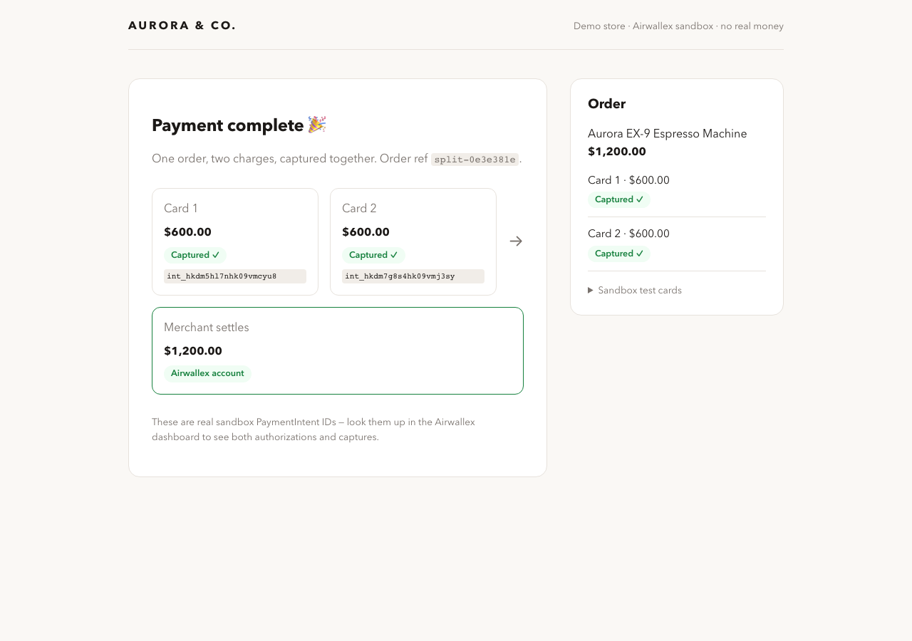

Server-side record (SQLite) after completion: order group `captured`, both slots `captured`. Retrieve on each intent returns `SUCCEEDED` with the full `captured_amount`.

## Failure path: Card B declines, nothing captured, retry in place

Order `split-804b5d78`, split $1,119.49 / $80.51.

| Card | Amount | PaymentIntent | Journey |
|---|---|---|---|
| 1 | $1,119.49 | `int_hkdm7g8s4hk0agloyw4` | held, captured only after card 2 recovered |
| 2 | $80.51 | `int_hkdm5hl7nhk0aglv5qn` | declined by the risk engine, retried with a good card, captured |

1. Card 1 held. Card 2 was attempted with the always-declines test card (`4646 4646 4646 4644`). The decline surfaced with friendly copy, Card 1's hold stayed untouched, and **nothing was captured** (server state: group `partially_authorized`, captured amounts all zero):

   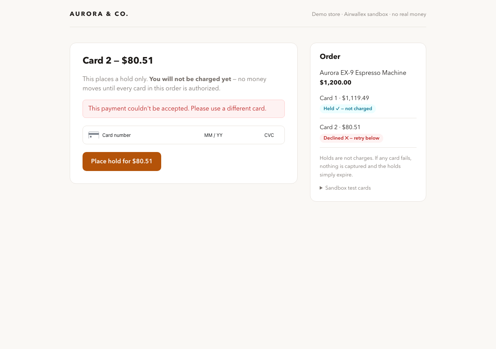

2. Card 2 retried in place with a valid card. Same order, same intent, no restart, and both captured together:

   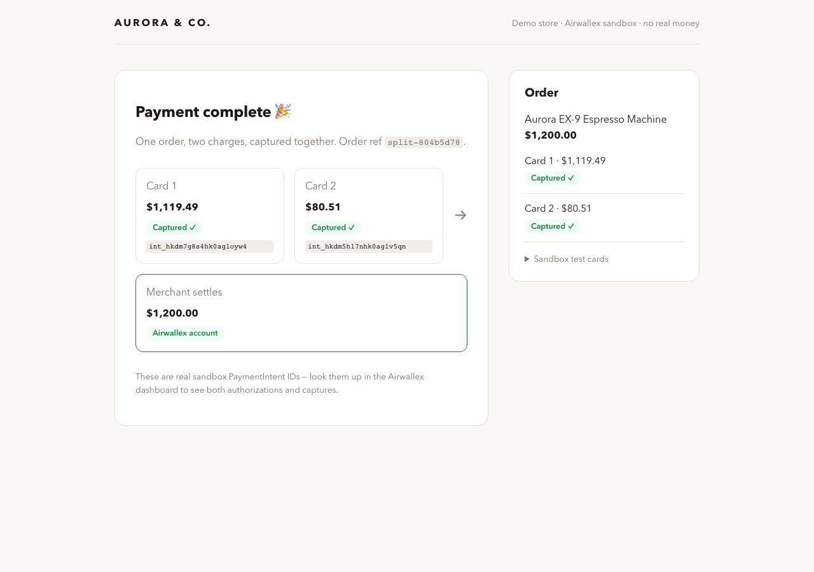

## Live deployment and dashboard proof

Order `split-44feffe5`, run by hand against the hosted demo (https://split-checkout-demo.fly.dev), AUD $1,200.00 split 50/50, intents `int_hkdm5hl7nhk0bvbopk8` and `int_hkdm5hl7nhk0bvbsob7`:

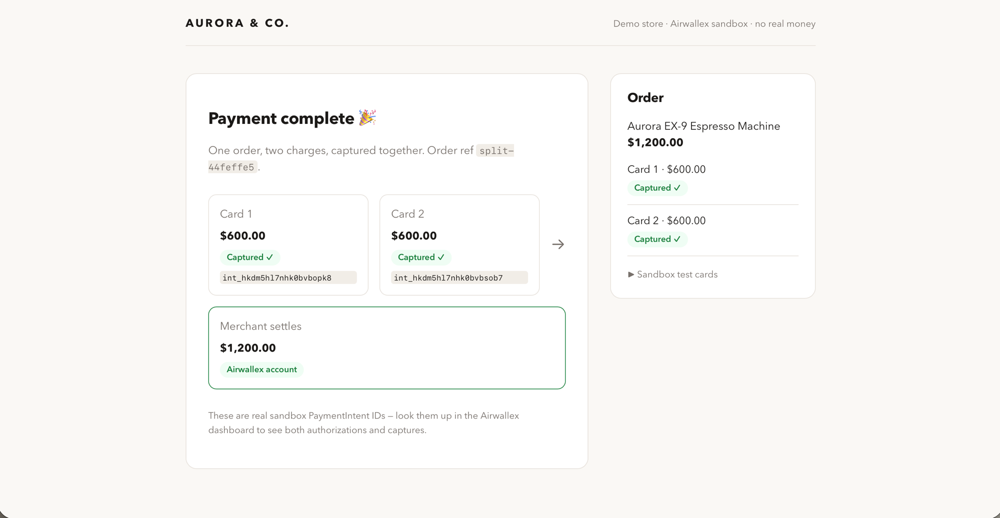

The same two charges in the Airwallex dashboard (Payments, then Payment activity), both **Succeeded**, $600.00 AUD each, order IDs `split-44feffe5-card1` and `-card2`. This is Airwallex's own record of the split:

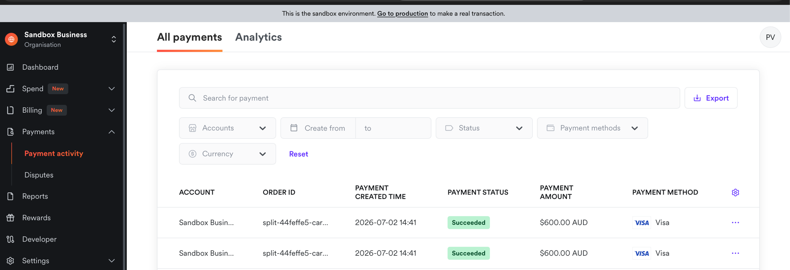

A recorded walk through the dashboard tells the whole story in one place: order `split-77f3e1ed` as two Succeeded $242.50 charges, order `split-98c93008` as two $600 charges both marked Refunded, and the payment detail for one refunded leg (auth code "00 Approved", $600.00 refunded):


And the dashboard's Analytics view of the same activity: a 100.00% payment acceptance rate across 34 successful attempts out of 34, the acceptance chart, and the declined-payments panel. (Refund figures live on the payment list and detail pages above; the sandbox Analytics tab covers acceptance and declines.)


## The decline path in Airwallex's own records

Order `split-0012a3a7`: a $700 Visa hold was placed, the $199 leg was declined by the risk engine, nothing was captured, and the surviving hold was explicitly released. The dashboard shows both legs Cancelled:

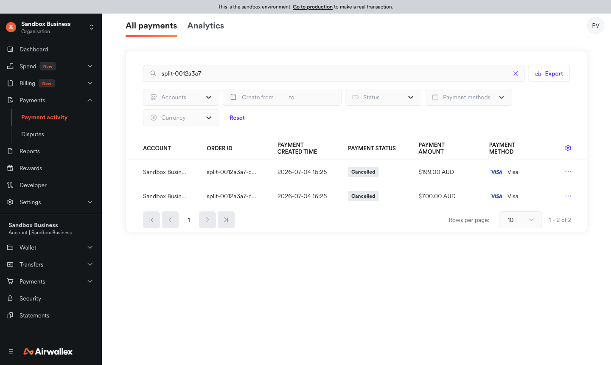

The declined leg's detail is Airwallex's own timeline of the safety story: Created, then Blocked, never Authorized, and Cancelled, on the always-declines test card:

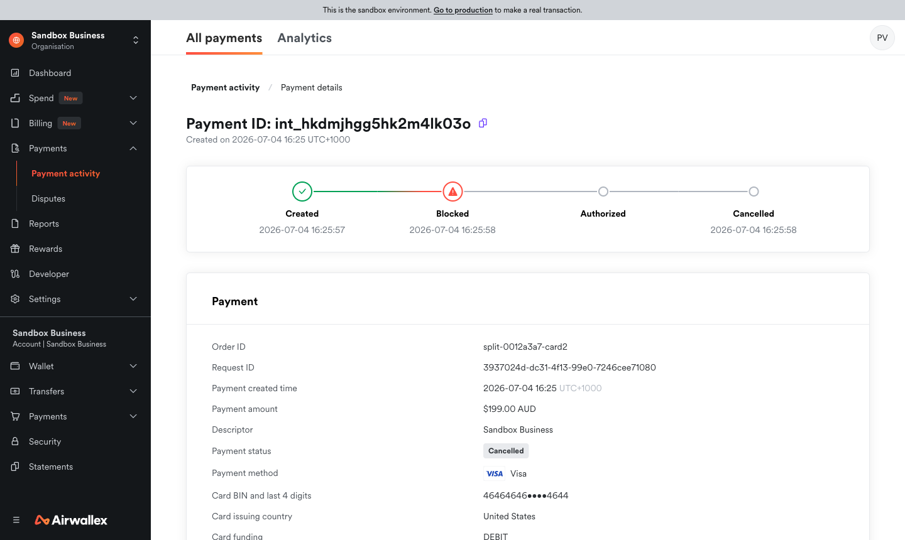

## Decline recovery: a failed single-card payment converts to a split

The rescue mode, and the deployment with the strongest commercial evidence (Air Europa's equivalent flow converts at 95.1%). A standard one-card payment is attempted with the always-declines card; instead of a dead end, the checkout offers to split:

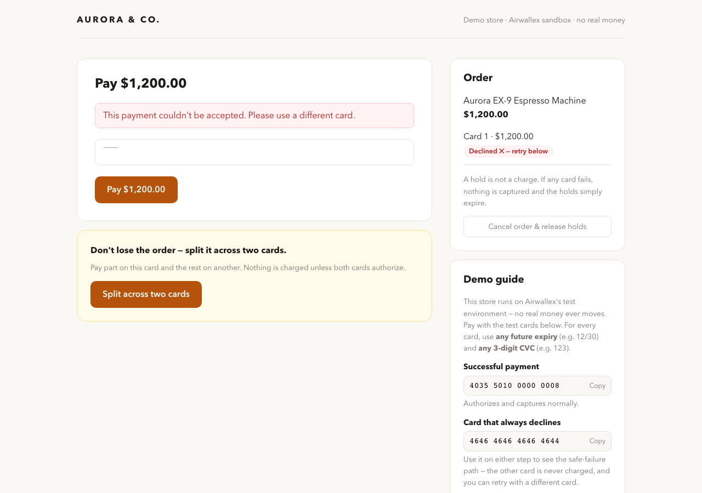

Accepting the offer cancels the failed intent (verified `CANCELLED` at Airwallex, exercising the hold-reversal path), and the shopper completes the same purchase across two cards (`int_hkdm5dghvhk0f7106vc` and `int_hkdmpgxk2hk0f713zpr`, both captured together):

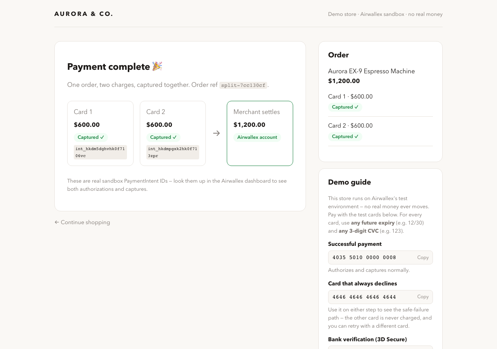

## Refund allocated pro-rata across both cards

The first question about split payment is "who gets the refund?". Answered concretely: an uneven order ($1,119.49 / $80.51) was captured on two cards, then refunded in full. Each card received back exactly what it paid, as two real Airwallex refunds against intents `int_hkdm5dghvhk0h0z4jkp` and `int_hkdm5dghvhk0h0z8f8k`:

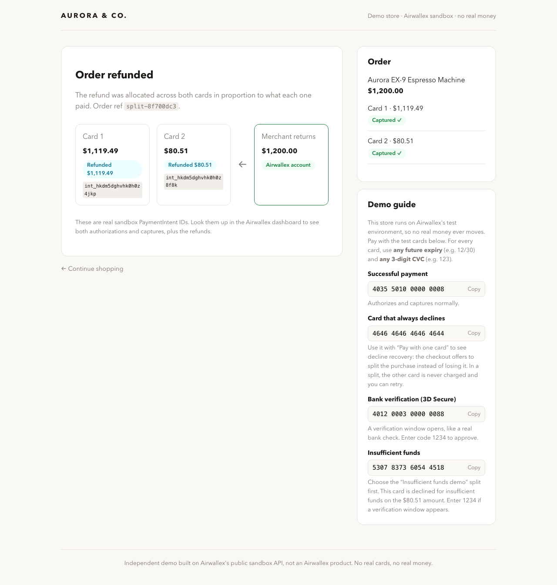

Partial refunds allocate proportionally with integer-cent math (covered by unit tests), and the API rejects anything beyond the captured total.

## Spending mandate enforcement

A $600 mandate created in the store's Agent mode, then driven by an agent over MCP. Verbatim outcomes:

| Agent attempt | Result |
|---|---|
| Barista Station Bundle, $1,950 | Refused: "This purchase (1950.00 AUD) exceeds the mandate's remaining budget of 600.00 AUD." No payment intent was created. |
| Aurora 64 Grinder, $485 | Captured: $242.50 + $242.50 across the mandate's two cards. Remaining budget: $115.00. |
| Gooseneck Kettle, $189 | Refused: "exceeds the mandate's remaining budget of 115.00 AUD." |

Also unit-tested: a declined card costs the budget nothing, refunds do not restore budget, expired and revoked mandates are refused, and an exhausted mandate reports its state.

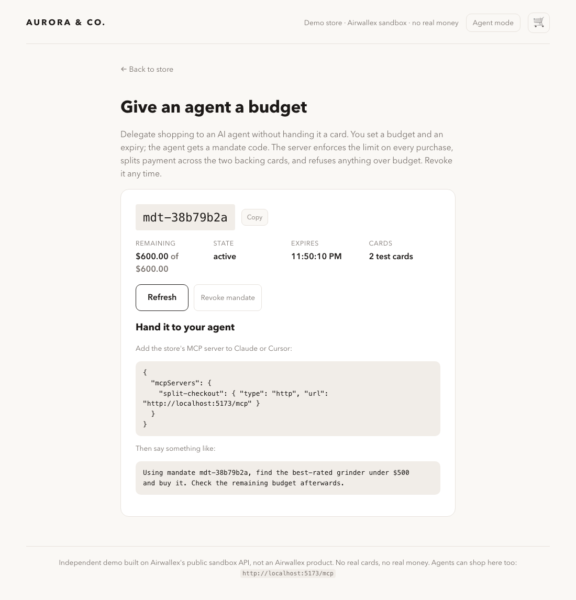

## Transaction-type matrix

Every documented sandbox card behavior, driven through the real UI (browser automation over the actual card-element iframes, one fresh order each). "Held" means the authorization landed and the capture-together gate would proceed. "Declined" means the slot stayed open for retry with the message shown.

| Scenario | Test card | Outcome | Shopper sees |
|---|---|---|---|
| Plain success | `4035 5010 0000 0008` | Held ✓ | (no message) |
| 3DS frictionless | `4012 0003 0000 0005` | Held ✓ | no challenge, brief authentication |
| 3DS challenge, correct OTP | `4012 0003 0000 0088` | Held ✓ | bank-verification modal, code `1234` |
| 3DS authentication fails | `4012 0003 0000 0013` | Declined, retryable | "Your bank couldn't verify this payment…" |
| 3DS challenge fails | `4012 0003 0000 0070` | Declined, retryable | modal, then "Your bank couldn't verify this payment…" |
| Insufficient funds (code 51) | `5307 8373 6054 4518` at $80.51 | Declined, retryable | modal, then "This card has insufficient funds…" |
| Risk-engine decline | `4646 4646 4646 4644` | Declined, retryable | "This payment couldn't be accepted…" |
| Invalid card number | `1111 1111 1111 1111` | Declined, retryable | "That card number doesn't look right…" |
| Insufficient-funds card at any *other* amount | `5307 8373 6054 4518` at $1,119.49 | Held ✓ | behaves like a normal card; the sandbox decline triggers only at exactly $80.51 (documented in the demo guide after user testing surfaced the confusion) |
| Shopper cancels the bank challenge | `4012 0003 0000 0088`, then Cancel | Declined, retryable | "Bank verification was cancelled. Try again when you're ready." |
| Browser refresh mid-checkout | any | Checkout restored | card 1's hold intact after reload, checkout resumes at card 2; the success screen also survives reload |

In every declined case the other card's hold was untouched and nothing was captured.

Mixed schemes split cleanly too: one order paid $500 on a Visa leg plus $399 on an American Express leg, captured together (`int_hkdmjhgg5hk1suwyrkc`, `int_hkdm9crz9hk1sux2vg9`). The demo's aliases cover all seven schemes Airwallex accepts.

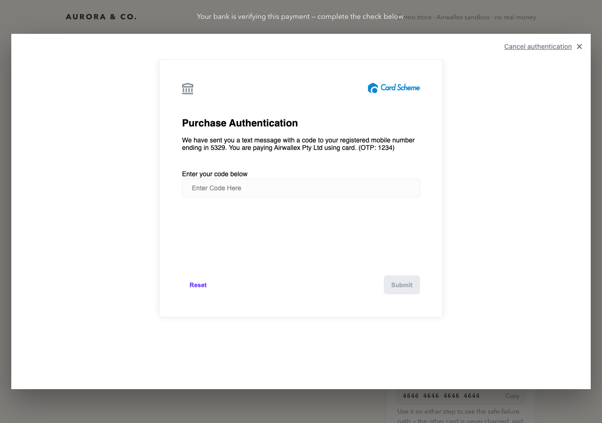

## Webhooks, live-proven, with a bonus

With a webhook registered against the hosted demo, a live purchase (order `split-25bd4898`, $98 split $49/$49) produced the full signed lifecycle in the production logs, every delivery verified and applied:

```
webhook: payment_intent.created applied to intent int_hkdmjhgg5hk2meug5zv
webhook: payment_intent.created applied to intent int_hkdm9crz9hk2meuk2v4
webhook: payment_intent.requires_capture applied to intent int_hkdmjhgg5hk2meug5zv
webhook: payment_intent.requires_capture applied to intent int_hkdm9crz9hk2meuk2v4
webhook: payment_intent.succeeded applied to intent int_hkdmjhgg5hk2meug5zv
webhook: payment_intent.succeeded applied to intent int_hkdm9crz9hk2meuk2v4
```

The bonus: the polling/webhook capture race that DECISIONS.md predicted and accepted as a demo-grade gap actually occurred on this first live delivery. Both channels reached the capture gate; one captured; the other's attempt failed cleanly upstream; the `succeeded` webhooks then settled local state to captured under the monotonic-transition rule. Airwallex's records confirm each intent captured exactly once ($49.00 each). A documented race, observed in the wild, converging exactly as designed.

## Sandbox finding worth knowing

Airwallex's insufficient-funds test card (`5307 8373 6054 4518` at $80.51) runs a **3DS challenge (OTP `1234`) before returning the code-51 decline**. The demo handles this (the challenge renders in the checkout via `authFormContainer`), and the discovery is written up in [DECISIONS.md](DECISIONS.md). Use it in a manual run to see the 3DS plus issuer-decline path; the scripted evidence above uses the no-3DS risk-decline card so the run is deterministic.

## Reproduce it yourself

```bash
npm install && npm run dev
# open http://localhost:5173 and pick any product
# success card: 4035 5010 0000 0008 / decline card: 4646 4646 4646 4644
# (any future expiry, any CVC)
```
