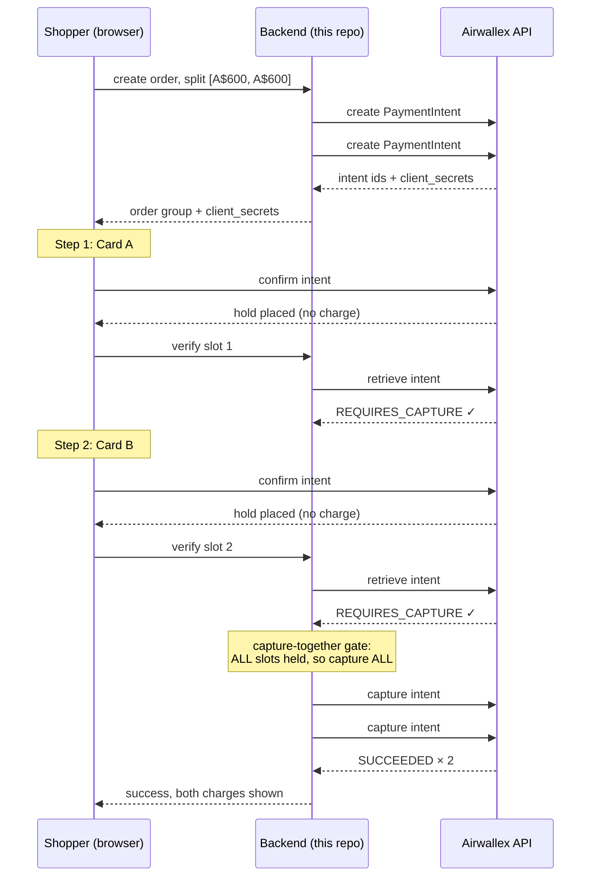

# Split Checkout

[](https://github.com/PremaanshVyas/split-checkout/actions/workflows/ci.yml)

**Pay for one order with two cards, on Airwallex.**


*Above: the decline-recovery flow. A single-card payment fails, the checkout offers to split the purchase, and both cards are authorized then captured together. Real sandbox PaymentIntents throughout.*


*And the receipts, in Airwallex's own dashboard: a split order lands as two Succeeded charges, a refunded order shows both cards Refunded, and the payment detail confirms the authorization and refund amounts. The [Analytics view](docs/evidence/dashboard-analytics.gif) shows a 100.00% acceptance rate across the demo's attempts. Full QA record in [EVIDENCE.md](EVIDENCE.md).*

A working demo of multi-card payment orchestration built directly on Airwallex's sandbox API. One order becomes N PaymentIntents, every card is *authorized without being charged*, and money moves only when all of the holds succeed: captured together, settling straight to the merchant's Airwallex account. It ships both deployment modes. **Upfront splitting** lets the shopper choose two cards from the start. **Decline recovery** converts a failed single-card payment into a split instead of a lost sale, which is the mode behind Air Europa's measured €2.4M recovery.

> **Try it now: https://split-checkout-demo.fly.dev** (sandbox only, no real money; test card numbers are on the checkout page). Or run it locally in two minutes ([below](#run-it-yourself)). The decline path is included, so you can watch a card fail safely in about ten seconds.
>
> **New here? Start with [PITCH.md](PITCH.md)**: the two-minute story of why this exists, why merchants don't build it themselves, and why it belongs inside Airwallex.

## Why this exists

High-ticket checkouts die at the payment step: a card limit, a low balance, or a shopper who wants to spread a purchase across funding sources. The industry numbers are blunt. Stripe's checkout research found **[85% of shoppers abandon](https://stripe.com/newsroom/news/state-of-checkouts-2022) a purchase when their preferred payment method isn't offered** (Airwallex's own materials cite 77% for the same effect), and insufficient funds is the [single largest cause of card declines](https://cdn2.hubspot.net/hubfs/464903/Ethoca%20Research%20Report%20-%20False%20Declines.pdf), which is exactly the failure a second card fixes. Splitting one payment across multiple cards is a conversion feature. Airwallex splits *outgoing* marketplace payouts, but nothing on the platform today splits an *incoming* payment.

This repo is an independent exploration of what that feature could look like built on Airwallex's existing primitives. No new money movement, no custody, just orchestration.

## How it works

The mechanism is the card networks' own two-phase protocol, applied across cards:



The invariants that make it safe:

- **Authorize is not charge.** Each confirm uses `autoCapture: false`, a documented Airwallex option that places a hold instead of charging. The UI says "you will not be charged yet" because it's literally true.
- **All-or-nothing capture.** The server captures *only* when every intent in the group reaches `REQUIRES_CAPTURE`. One declined card means zero captures.
- **Failure is free to unwind.** A declined confirm leaves that PaymentIntent open, so the shopper retries that card slot in place while the other card's hold stays untouched. Abandoned holds are cancelled explicitly (see below). No refunds and no reversals are ever needed, because no money moved.
- **The server never trusts the client.** After every confirm, the backend retrieves the intent from Airwallex and acts on that status. Airwallex's docs themselves warn that a completed client flow doesn't imply a successful payment.

## Why doesn't every store have this already?

Any supermarket register can split a bill across two cards, yet online it's near-extinct. A spot-check of ten major US retail sites found exactly [one](https://www.creditcards.com/education/split-payment-transaction-online-two-cards/) that accepts two credit cards on one order. The reasons are instructive:

- **It's not a card-network restriction.** Visa's [Partial Authorization Service](https://usa.visa.com/content/dam/VCOM/global/support-legal/documents/visa-partial-authorization-service.pdf) has explicitly supported split tender in eCommerce since 2005. Issuers and acquirers *must* support it, but implementing it is **optional for online merchants**, so almost none do.
- **Checkout APIs are one-instrument-per-transaction.** A payment intent takes exactly one card. Splitting an order means the merchant builds the multi-intent orchestration state machine themselves (that's this repo), and every downstream system (refunds, chargebacks, taxes, promotions, reconciliation) assumes one order equals one payment.
- **Doing it sloppily costs real money.** Visa [fines authorizations](https://usa.visa.com/content/dam/VCOM/regional/na/us/support-legal/documents/authorization-and-reversal-processing-best-practices-for-merchants.pdf) that are never captured or reversed, and expects sibling holds to be reversed within 24 hours when an order won't complete. This demo complies: nothing dangles. Failed or abandoned orders have their holds cancelled explicitly, through a cancel button and a server-side stale-hold sweep.
- **Gift cards make the gap personal.** Closed-loop store cards (an Amazon balance) combine fine, because that's the merchant's internal ledger. Open-loop prepaid Visa and Mastercard gift cards are real card transactions, so combining them *is* multi-card payment. This is why [43% of US adults](https://www.bankrate.com/credit-cards/news/gift-cards-survey/) sit on unused gift cards averaging $244 each.
- **Filling the gap measurably pays.** Air Europa added split payments to checkout in 2024 and attributes [€3.8M in incremental revenue](https://thefintechtimes.com/air-europa-selects-hands-in-to-add-split-payments-to-checkout-boosting-revenue-by-e3-8million/) to it, with the two-card decline-recovery flow converting at 95.1%.

### Why no payments license is needed

This system never holds, pools, or forwards shopper funds. Each capture settles directly from the shopper's card to the merchant's Airwallex account through Airwallex's existing rails. Orchestration-only means none of the stored-value or purchased-payment-facility regimes (AFSL, ASIC, AUSTRAC in Australia) are triggered. The moment an implementation would route money through anything the operator controls, it's out of bounds. By design, this one can't.

## What's in the repo

```
server/   Express + TypeScript. Airwallex client (~130 lines, raw REST),
          order-group state machine, capture-together gate, SQLite.
web/      Vite + React checkout: store, split editor, sequential card
          stepper on @airwallex/components-sdk, status chips.
```

- [DECISIONS.md](DECISIONS.md) records every non-obvious choice, dated, with alternatives and reasoning (including one genuine sandbox surprise involving 3DS).
- [EVIDENCE.md](EVIDENCE.md) is the QA record: real intent IDs and screenshots for the happy path, the decline paths, and the full transaction-type matrix.
- `.mcp.json` ships a config for [Airwallex's Developer MCP](https://www.airwallex.com/docs/developer-tools/ai/developer-mcp) (part of Airwallex AgentOS), so AI coding tools working in this repo get live Airwallex API docs and sandbox tooling.

## Run it yourself

You need Node 20+ and a free [Airwallex sandbox account](https://www.airwallex.com/docs/developer-tools/sandbox-environment) (no KYC, instant).

```bash
git clone https://github.com/PremaanshVyas/split-checkout.git && cd split-checkout
cp .env.example .env
# fill in AIRWALLEX_CLIENT_ID and AIRWALLEX_API_KEY
# (demo.airwallex.com > Settings > Developer > API keys > Generate)
npm install
npm run dev
```

Open http://localhost:5173 and pick any product. All test cards take any future expiry and any 3-digit CVC; the checkout page lists them too.

1. **The happy split:** choose "or split it across two cards", keep the 50/50 split, and pay both steps with `4035 5010 0000 0008`. Both cards show as held, then captured together, with real intent IDs on screen.
2. **Decline recovery:** choose "Pay with one card" and use `4646 4646 4646 4644`, which always declines. The checkout offers to split the purchase instead; accept, then finish with the good card on both steps.
3. **A decline inside a split:** use the "Insufficient funds demo" preset and pay card 2 with `5307 8373 6054 4518`. That card declines with issuer code 51 on the $80.51 slot (enter `1234` if a bank-verification window appears). Card 1's hold survives, nothing is captured, and you retry in place.

Sandbox note: amounts formatted `$8x.xx` are reserved by Airwallex to trigger error responses. The insufficient-funds preset uses that deliberately.

## Agentic checkout (MCP)

Airi's roadmap is agents that transact on a shopper's behalf. This repo includes a working preview of what that looks like with split payment: an MCP server that lets an AI agent browse the store and complete a purchase across multiple cards, with the same all-or-nothing capture semantics as the human checkout.

Add it to Claude Code, Claude Desktop, or Cursor:

```json
{
  "mcpServers": {
    "split-checkout": {
      "command": "node",
      "args": ["mcp/server.mjs"]
    }
  }
}
```

Then ask the agent something like *"buy the espresso machine, put $700 on the first card and $500 on the second"*. The agent gets five tools (`list_products`, `split_purchase`, `order_status`, `refund_order`, `cancel_order`) and returns real sandbox PaymentIntent ids. A sample run:

```
> split_purchase(sku: "aurora-ex-9", splits: [700, 500], cards: ["success", "success_mastercard"])
{ "status": "captured", "cards": [
    { "card": 1, "amount": 700, "status": "captured", "airwallex_intent_id": "int_hkdmjhgg5hk1o0opwwy" },
    { "card": 2, "amount": 500, "status": "captured", "airwallex_intent_id": "int_hkdmjhgg5hk1o0ovqsl" } ] }

> refund_order(order_id, amount: 150)
refunded 150 AUD, allocated 87.50 / 62.50 across the cards (pro-rata to the 700/500 split)
```

Safety: the agent endpoint accepts **only Airwallex's published sandbox test cards** (or friendly aliases like `success` and `decline`); any other number is rejected before a single API call. Server-side card handling here is a sandbox demo device; a production agent flow would use tokenized credentials or wallet delegation (which is precisely Airi territory), never raw PANs. It points at the hosted demo by default; set `SPLIT_CHECKOUT_URL` to use a local instance.

## Honest limitations

This is a demo of the core mechanism, not a finished product. Production would additionally need:

- **Refund policy depth.** Refunds are implemented (full or partial, allocated pro-rata across the cards to the cent, as real Airwallex refunds); production would add per-merchant policy choices (last-card-first, shopper-selected), settlement tracking via `refund.*` webhooks, and handling for expired or replaced cards.
- **Dispute handling across issuers.** One order can now generate chargebacks from two banks with independent timelines.
- **Scheme rules review.** Card-network rules on split tender and on authorization windows vary per scheme. The demo captures within seconds, well inside every window.
- **Webhook-first status.** A signed webhook listener is implemented (HMAC-SHA256 verification, `payment_intent.*` events feeding the same state machine, safe under duplicate and out-of-order delivery), but the demo remains polling-primary so it runs deterministically from a fresh clone with no public URL. Production would invert that: webhooks drive, polling reconciles. To enable it, register `https://<your-host>/api/webhooks/airwallex` in the Airwallex dashboard (Developer, then Webhooks) and set `AIRWALLEX_WEBHOOK_SECRET`.
- **Capture-retry hardening.** A capture failure after partial success currently leaves the group retryable via the same idempotent gate; production wants an async worker with alerting.
- **More than two cards.** The data model and capture gate are already N-ary; only the UI is fixed at two.
- **True partial authorization.** Visa's partial-auth flow lets a low-balance prepaid card approve *part* of the requested amount, with the remainder rolling to the next card automatically, so nobody has to guess the gift card's balance. It needs acquirer-level support not exposed through PaymentIntents today, and it's the natural next primitive for this feature.

## Disclaimer

This is an independent demo built against Airwallex's public sandbox API for exploration and discussion. It is not an Airwallex product and is not affiliated with, endorsed by, or sponsored by Airwallex. No real cards and no real money; Airwallex's published test cards only.
