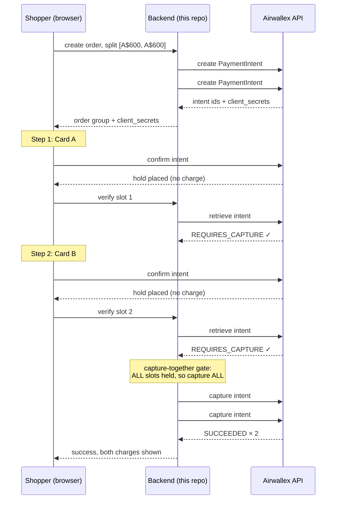

# Split Checkout (Read below for the problem statement)

[](https://github.com/PremaanshVyas/split-checkout/actions/workflows/ci.yml) [](LICENSE)

**Pay for one order with two cards, on Airwallex.** A working store where a payment can split across multiple cards, a declined card converts into a rescue instead of a lost sale, and an AI agent can shop and pay under a budget the server enforces.


*The decline-recovery flow: a single-card payment fails, the checkout offers to split the purchase, and both cards are authorized then captured together. Real sandbox PaymentIntents throughout.*


*The receipts, in Airwallex's own dashboard: a split order lands as two Succeeded charges, a refunded order shows both cards Refunded, and the payment detail confirms the amounts. Full QA record in [EVIDENCE.md](EVIDENCE.md).*

> **Try it now: https://split-checkout-demo.fly.dev** (sandbox only, no real money; test cards are on the checkout page). Agents can shop it too: add `https://split-checkout-demo.fly.dev/mcp` to Claude or Cursor. New here? [PITCH.md](PITCH.md) is the two-minute story.

## The problem

I won $2,000 in an essay competition, paid out as two $1,000 prepaid Visa gift cards. I tried to buy a Galaxy S26 Ultra on Samsung's Australian online store: AUD $1,389 after stacking an education discount and two more from their sales chat. I had the money, on two perfectly valid Visa-network cards, and the checkout physically could not take it. One card per order. JB Hi-Fi was the same. So was almost everywhere else I checked, even though any register in any physical store handles split payment without a second thought.

That is not a niche inconvenience. [43% of US adults](https://www.bankrate.com/credit-cards/news/gift-cards-survey/) sit on unused gift cards averaging $244 each; Stripe's checkout research found [85% of shoppers abandon](https://stripe.com/newsroom/news/state-of-checkouts-2022) a purchase when their preferred payment method isn't offered; and insufficient funds is the [single largest cause of card declines](https://cdn2.hubspot.net/hubfs/464903/Ethoca%20Research%20Report%20-%20False%20Declines.pdf), the exact failure a second card fixes. This repo is the fix, built on Airwallex's sandbox using nothing but their existing primitives: no new money movement, no custody, just orchestration.

## What it does

- One order becomes N PaymentIntents, each card authorized without being charged (`autoCapture: false`); capture happens together only when every hold succeeds, so a declined card never strands a charged one.
- Two checkout modes: choose to split upfront, or pay normally and get offered a split when the card declines (the mode behind Air Europa's measured [EUR 2.4M recovery](https://thefintechtimes.com/air-europa-selects-hands-in-to-add-split-payments-to-checkout-boosting-revenue-by-e3-8million/) at 95.1% conversion).
- Refunds allocate back pro-rata across the cards, exact to the cent, as real Airwallex refunds.
- Every failure path is handled and tested: 3DS challenges render in a modal, abandoned holds are reversed within Visa's rules (a cancel button plus a server-side sweep), checkout survives a browser refresh, and mixed schemes split cleanly (a Visa leg plus an Amex leg, captured together).
- A remote MCP server lets an AI agent search the catalog, assemble a basket, and pay, including under a spending mandate: a budget the human grants and the server enforces, so the agent never touches a card.
- Every split part is self-describing in Airwallex's systems: shared order reference, part labels, and totals in metadata, so two transactions reconcile as one order in settlement reports today.

## How it works

The mechanism is the card networks' own two-phase protocol, applied across cards:



The invariants that make it safe: authorize is not charge (a hold costs nothing to unwind); capture is all-or-nothing; a declined confirm leaves that intent open for in-place retry while the other card's hold stays untouched; abandoned orders have their holds cancelled explicitly rather than left to expire; and the server never trusts the client, re-checking every intent's true status with Airwallex before acting.

## Why doesn't every store have this already?

Any supermarket register can split a bill across two cards, yet online it's near-extinct. A spot-check of ten major US retail sites found exactly [one](https://www.creditcards.com/education/split-payment-transaction-online-two-cards/) that accepts two credit cards on one order. The reasons are instructive:

- It's not a card-network restriction. Visa's [Partial Authorization Service](https://usa.visa.com/content/dam/VCOM/global/support-legal/documents/visa-partial-authorization-service.pdf) has explicitly supported split tender in eCommerce since 2005, and Visa's rulebook permits two-cards-one-order by name. Implementing it is simply optional for online merchants, so almost none do.
- Checkout APIs are one-instrument-per-transaction. A payment intent takes exactly one card. Splitting an order means the merchant builds the multi-intent orchestration state machine themselves (that's this repo), and every downstream system assumes one order equals one payment.
- Doing it sloppily costs real money. Visa [fines authorizations](https://usa.visa.com/content/dam/VCOM/regional/na/us/support-legal/documents/authorization-and-reversal-processing-best-practices-for-merchants.pdf) that are never captured or reversed, and expects sibling holds reversed within 24 hours when an order won't complete. This demo complies: nothing dangles.
- Gift cards make the gap personal. Closed-loop store cards combine fine (that's the merchant's internal ledger). Open-loop prepaid Visa and Mastercard gift cards are real card transactions, so combining them *is* multi-card payment.

This is exactly the shape of problem that belongs in the platform rather than in every merchant's codebase, and the platform's side of the ledger holds up: the split's marginal cost is one fixed fee (~A$0.30) that per-order pricing could zero out, surcharging is moot in Australia after the RBA's October 2026 reform, and both transactions reconcile as one order through metadata this demo already populates. The full costed argument, including a phased rollout proposal, is in [OPERATORS.md](OPERATORS.md).

No payments license is needed anywhere in this design: money settles directly from the shopper's card to the merchant's Airwallex account through Airwallex's existing rails, so none of the stored-value regimes (AFSL, ASIC, AUSTRAC in Australia) are triggered.

## Agentic checkout (MCP)

Airi's roadmap is agents that transact on a shopper's behalf. This demo hosts a remote MCP server, so an agent can browse the catalog with filters, assemble a multi-item basket, and complete the purchase across multiple cards, with the same all-or-nothing capture semantics as the human checkout. Zero install:

```json
{
  "mcpServers": {
    "split-checkout": {
      "type": "http",
      "url": "https://split-checkout-demo.fly.dev/mcp"
    }
  }
}
```

| Tool | What it does |
|---|---|
| `search_catalog` | Free-text plus filters (category, color, price range, in-stock, sort) with facet counts |
| `get_product` | Full detail for one sku, including color options, stock, and image |
| `split_purchase` | Buy a basket across N cards, by mandate code or card aliases; omit `splits` for an even division |
| `order_status` | Items, per-card slots, refunds for an order |
| `refund_order` | Full or partial refund, allocated pro-rata across the cards to the cent |
| `cancel_order` | Reverse every hold on an uncaptured order |
| `mandate_status` | A spending mandate's remaining budget, expiry, and state |
| `create_demo_mandate` | Demo-only: mint a mandate without the store UI (in production this is a wallet action the human authorizes) |

The delegation layer is the part worth staring at. In the store's Agent mode a human grants a spending mandate (budget, expiry, backing cards) and hands the agent a code; the agent never sees a card, and the server enforces the budget. A real transcript from a $600 mandate:

```
> split_purchase(items: [{sku: "aurora-barista-bundle"}], mandate: "mdt-05220909")
This purchase (1950.00 AUD) exceeds the mandate's remaining budget of 600.00 AUD.

> split_purchase(items: [{sku: "aurora-grinder-64"}], mandate: "mdt-05220909")
captured: $242.50 + $242.50 across the mandate's two cards. Remaining budget: 115.00 AUD.

> split_purchase(items: [{sku: "aurora-kettle"}], mandate: "mdt-05220909")
This purchase (189.00 AUD) exceeds the mandate's remaining budget of 115.00 AUD.
```

The refusals come from the payment layer, not the agent's judgment. The shape mirrors ACP allowances, AP2 mandates, and the card networks' agentic tokens, with the one thing none of them define: a grant spanning multiple funding sources, enforced across all of them together. Browse tools are open; the purchase tool accepts only Airwallex's published sandbox test cards (aliases cover all seven schemes), and real card numbers are rejected before any API call.

## Run it yourself

Node 20+ and a free [Airwallex sandbox account](https://www.airwallex.com/docs/developer-tools/sandbox-environment) (no KYC, instant).

```bash
git clone https://github.com/PremaanshVyas/split-checkout.git && cd split-checkout
cp .env.example .env
# fill in AIRWALLEX_CLIENT_ID and AIRWALLEX_API_KEY
# (demo.airwallex.com > Settings > Developer > API keys > Generate)
npm install
npm run dev
# expect: "split-checkout server listening on http://localhost:3001"
#         and Vite on http://localhost:5173
```

Open http://localhost:5173 and pick any product. All test cards take any future expiry and any 3-digit CVC; the checkout page lists them too.

1. The happy split: choose "or split it across two cards", keep 50/50, pay both steps with `4035 5010 0000 0008`. Both cards hold, then capture together, with real intent IDs on screen.
2. Decline recovery: choose "Pay with one card" and use `4646 4646 4646 4644`, which always declines. Accept the offered split, then finish with the good card.
3. A decline inside a split: use the "Insufficient funds demo" preset and pay card 2 with `5307 8373 6054 4518` (declines with issuer code 51 on the $80.51 slot; enter `1234` if a bank-verification window appears). Card 1's hold survives, nothing is captured, and you retry in place.
4. Agent mode (header button): create a spending mandate and hand the code to an agent connected to `/mcp`.

Sandbox note: amounts formatted `$8x.xx` are reserved by Airwallex to trigger error responses. The insufficient-funds preset uses that deliberately.

## Documentation

| Doc | Read this if you want |
|---|---|
| [PITCH.md](PITCH.md) | The two-minute story: why this exists, why merchants can't build it, why it belongs inside Airwallex |
| [EVIDENCE.md](EVIDENCE.md) | The QA record: real intent IDs, screenshots, dashboard proof, the full transaction-type matrix |
| [OPERATORS.md](OPERATORS.md) | The platform's side: fee math, the RBA's 2026 reforms, scheme legality, card-type analysis, and the phased zero-hassle rollout proposal |
| [DECISIONS.md](DECISIONS.md) | Every non-obvious engineering choice, dated, with alternatives and the dead ends included |
| [ATTRIBUTIONS.md](ATTRIBUTIONS.md) | Product photography credits (openly licensed, hand-curated) |

## What's in the repo

```
server/   Express + TypeScript. Airwallex client (raw REST), order-group
          state machine, capture-together gate, mandates, remote MCP
          endpoint, SQLite.
web/      Vite + React storefront: catalog with filters, cart, sequential
          card stepper on @airwallex/components-sdk, agent mode.
```

Forty-seven tests cover the state machine, refund allocation, mandate enforcement, webhook signatures, catalog search, and the concurrency races; CI runs them plus typecheck, lint, and a production build on every push. The `.mcp.json` also points AI coding tools at [Airwallex's Developer MCP](https://www.airwallex.com/docs/developer-tools/ai/developer-mcp).

## Honest limitations

This is a demo of the core mechanism, not a finished product. Production would additionally need: refund policy depth (per-merchant allocation choices, settlement tracking via `refund.*` webhooks); dispute handling across two issuers; webhook-first status (the signed listener is implemented and race-safe, but the demo stays polling-primary so it runs from a fresh clone with no public URL); capture-retry via an async worker; more than two cards in the UI (the data model and gate are already N-ary); and true partial authorization, so a low-balance prepaid card can approve what it holds with the remainder rolling to the next card. The known demo-grade gaps (bearer-token mandates, in-process rather than distributed locking) are each named in [DECISIONS.md](DECISIONS.md) with the production answer; the polling/webhook capture race that was once on this list was predicted, then observed live, then closed with a per-order lock and race tests.

## Disclaimer

This is an independent demo built against Airwallex's public sandbox API for exploration and discussion. It is not an Airwallex product and is not affiliated with, endorsed by, or sponsored by Airwallex. No real cards and no real money; Airwallex's published test cards only. Product photography is openly licensed; see [ATTRIBUTIONS.md](ATTRIBUTIONS.md).

MIT licensed. Built by [Premaansh Vyas](https://github.com/PremaanshVyas) (premaanshvyas04@gmail.com).
